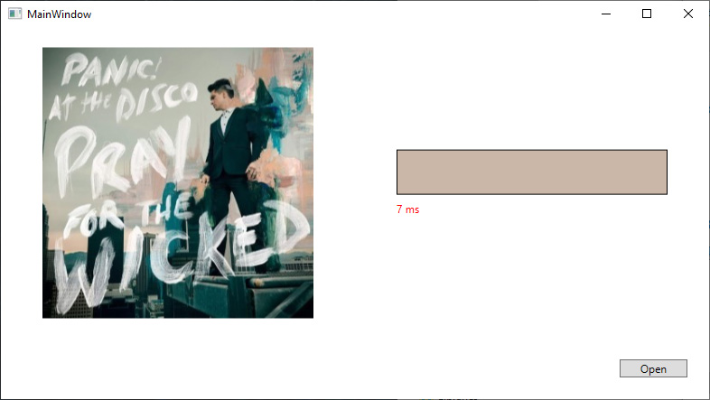
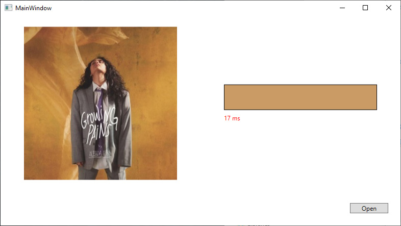
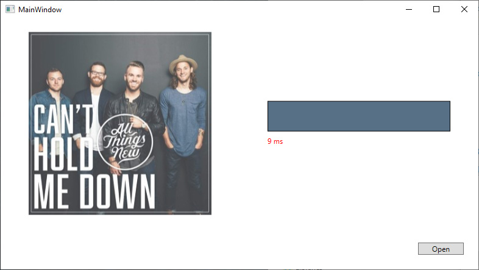
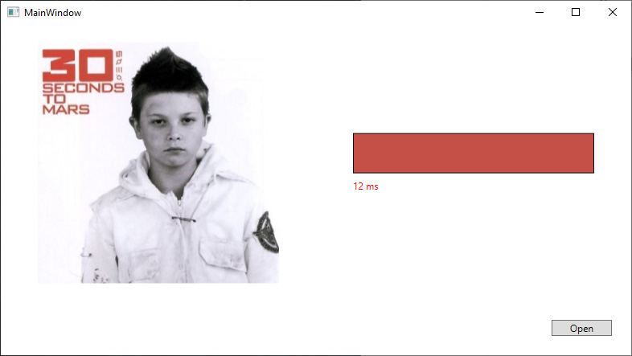

# Color Picker
### Version: 1.0.0

Code for selecting a relatively saturated, high coverage color from the image.






### How to use:
``` C#
var colorPicker = new ColorPicker();
Color color = colorPicker.GetMediaColor(imagePath);
```

### License:
This project is released under the Apache 2.0 License for non-commercial use. For commercial use, please contact us for another license.
